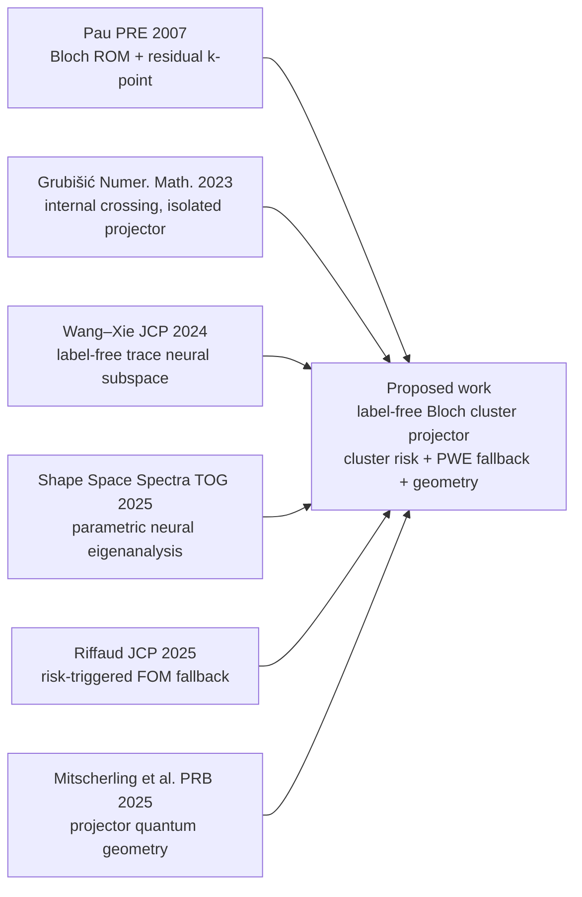

# 创新机制的正式期刊证据链

> 核验日期：2026-07-29  
> 核心结论：当前方向不是凭空构造。“谱簇目标、无标签 trace 神经子空间、Bloch reduced basis、residual/gap 风险指标、高风险数值回退、projector quantum geometry”均有同行评审期刊先例。未发现将这些部件完整结合到“无标签二维 Bloch–Schrödinger 内部精确简并谱投影”的同构期刊论文。
> 本地全文索引：[创新机制期刊证据链](../../01_%E6%96%87%E7%8C%AE%E5%BA%93/00_%E5%BD%93%E5%89%8D%E4%B8%BB%E7%BA%BF%E5%BF%85%E8%AF%BB/10_%E5%88%9B%E6%96%B0%E6%9C%BA%E5%88%B6%E6%9C%9F%E5%88%8A%E8%AF%81%E6%8D%AE%E9%93%BE/README.md)

## 0. 当前方法的准确名称

当前已实现底座是：

> 基于 dual-path 正交化和三平面波物理 anchor 的无标签二维参数化坐标 MLP Ky Fan 变分本征求解器。

网络使用周期 sin/cos（Fourier）输入特征；域积分用随机平移的均匀周期网格做等权数值求积，空间导数由 autograd 计算。三平面波是低阶先验 anchor，PWE 是参考解/基线/拟议 fallback，因此主方法不应称为“Fourier–Galerkin 神经求解器”。

## 1. 先明确“文献佐证”能证明什么

必须区分四个层次：

1. **数学可行性**：外部谱隙存在时，簇内可以交叉，整个谱投影仍是合理的参数函数。
2. **算法先例**：trace 神经子空间、ROM、residual/gap 指标、高保真回退等部件已在同行评审论文中运行成功。
3. **发表先例**：神经网络求 PDE 本征问题、参数族本征分析和重数/交叉处理均已被正式期刊接受。
4. **本文经验有效性**：仍必须由 P3、CUDA 对照、消融、risk–coverage 和 quantum-geometry 实验自行证明。文献不能代替本文实验。

因此，正确的说法不是“既有期刊已经证明本文整个算法一定成功”，而是：

> 既有期刊已分别证实了整个机制所依赖的数学对象、神经变分目标、误差感知路由和下游物理量是合理的；本文要验证的是这些原理能否在 Bloch 内部简并问题中形成可靠的无标签神经求解器。

## 2. 最小且足够强的五篇核心佐证

### 2.1 最直接的数学依据：交叉时学整个谱簇

**Grubišić, Saarikangas & Hakula, 2023**  
*Stochastic collocation method for computing eigenspaces of parameter-dependent operators*, **Numerische Mathematik 153, 85–110**.  
DOI: [10.1007/s00211-022-01339-3](https://link.springer.com/article/10.1007/s00211-022-01339-3)

已证明：

- 在该文的解析/仿射算子参数依赖与一致适定性假设下，若目标谱簇与外部频谱保持隔离，则谱投影可随参数解析变化；
- 谱簇内部本征值可以交叉；
- 整个 eigenspace 的近似仍可收敛，朴素的逐本征对近似会丧失收敛性。

它直接佐证当前论文的根本目标：**在内部 crossing 处预测 rank-2 projector，不逐带编号。**

### 2.2 最直接的无标签神经 trace 依据

**Wang & Xie, 2024**  
*Computing multi-eigenpairs of high-dimensional eigenvalue problems using tensor neural networks*, **Journal of Computational Physics 506, 112928**.  
DOI: [10.1016/j.jcp.2024.112928](https://www.sciencedirect.com/science/article/pii/S0021999124001773)

已实现：

- 不使用真实本征解标签；
- 用 \(k\) 个 TNN 张成 trial subspace；
- 直接最小化 \(\operatorname{tr}(B^{-1}A)\)，对应最低 \(k\) 个本征值之和的 Ky Fan 型变分目标；
- 训练后在神经 trial space 中解小型广义本征问题。

它证明“无标签 trace 神经子空间”已是成熟可行的期刊算法路线，但也意味着 trace/Ky Fan 本身不是本文创新。

### 2.3 最直接的参数神经本征与重数点依据

**Chang et al., 2025**  
*Shape Space Spectra*, **ACM Transactions on Graphics 44(4), Article 121**.  
DOI: [10.1145/3731148](https://www.dgp.toronto.edu/projects/sss/)

该文已用一组联合训练的无标签参数神经场（每个模态对应一个 MLP），对连续形状族进行变分 PDE eigenanalysis，并用动态重排和 causal gradient filtering 处理重数点的 mode crossover。

这是当前论文最重要的**期刊级平行写作模板**。它与本文的关键差异是：该文为每个模态设置 MLP 并动态追踪具体模态，本文则拟用单一参数网络直接学习 basis-invariant Bloch spectral projector。

### 2.4 最直接的 Bloch ROM + residual 选点依据

**Pau, 2007**  
*Reduced-basis method for band structure calculations*, **Physical Review E 76, 046704**.  
DOI: [10.1103/PhysRevE.76.046704](https://journals.aps.org/pre/abstract/10.1103/PhysRevE.76.046704)

该文已经将波矢 κ 作为参数，使用 reduced basis 快速计算能带，并用残差型后验指标驱动 greedy 选取新的 k 点。

它证明 **Bloch 能带 + ROM + residual-driven k-point sampling** 是可行的数值路线，但也明确限制本文不能把这三者单独写成创新。

### 2.5 最直接的“风险触发高保真回退”依据

**Riffaud, 2025**  
*Accurate and robust predictions for model order reduction via an adaptive, hybrid FOM/ROM approach*, **Journal of Computational Physics 523, 113677**.  
DOI: [10.1016/j.jcp.2024.113677](https://www.sciencedirect.com/science/article/pii/S0021999124009252)

该文的正式机制是：

- 用廉价误差指标判断 ROM 预测是否可信；
- 当误差超过阈值时，在线切换到高保真 FOM；
- 用新高保真快照继续更新 ROM；
- 同时报告误差控制与计算成本。

这与本文拟设计的“可计算 risk score 触发 PWE 回退”在算法结构上高度相似。因此 fallback 不是凭空想象，但也不能把“有 fallback”本身宣称为创新。

## 3. 完整机制的期刊证据图

这张图的含义是：每条输入边都有正式期刊依据；中间的完整闭环则是本文必须通过实验证明的新组合。

## 4. 其他直接支撑论文

| 机制 | 正式期刊 | 对本文的作用 | 不能被它证明的内容 |
|---|---|---|---|
| 高重数时 eigenspace 才是合理对象 | Dölz & Ebert, *SIAM JNA* 62(1), 2024, [10.1137/22M1529324](https://epubs.siam.org/doi/10.1137/22M1529324) | 佐证不应对简并处单根 eigenfunction 做统计/回归 | 不是 Bloch 神经求解器 |
| neural trial space + POD + Galerkin | Dai, Fan & Sheng, *CNSNS*, online 2026, [10.1016/j.cnsns.2026.110060](https://www.sciencedirect.com/science/article/pii/S1007570426004193) | 佐证神经基、降维、正交化与 Galerkin 的期刊可行性 | 尚为 Journal Pre-proof；无参数 Bloch crossing |
| 二/三维真实 PDE 多本征对 | Jiang et al., *JCP* 549, 2026, [10.1016/j.jcp.2025.114605](https://www.sciencedirect.com/science/article/pii/S0021999125008873) | FieldTNN 求 Maxwell eigen-PDE，嵌入 divergence-free 约束过滤伪模态 | 不是参数化 projector |
| residual/gap 多重本征值指标 | Horger et al., *ESAIM: M2AN* 51, 2017, [10.1051/m2an/2016025](https://www.numdam.org/articles/10.1051/m2an/2016025/) | 佐证 residual 除以外部谱隙的风险结构、greedy 选参数和完整 eigenspace 入基 | 不是神经网络；严格上下界不能直接移植 |
| clusters/intersections 会破坏朴素 ROM | Boffi et al., *Computational and Applied Mathematics* 43, 2024, [10.1007/s40314-024-02917-x](https://link.springer.com/article/10.1007/s40314-024-02917-x) | 佐证交叉/聚簇是实际数值难题，需要 cluster-level 处理 | 未给出本文拟用的神经风险分数 |
| 神经 PDE + 后验误差自适应 | Wang et al., *Journal of Scientific Computing* 101, 2024, [10.1007/s10915-024-02700-4](https://link.springer.com/article/10.1007/s10915-024-02700-4) | 佐证可用 a posteriori estimator 设计神经 PDE/本征损失并自适应优化 | 不是 cluster-specific routing |
| ML–ROM–FOM 分层可靠模型 | Haasdonk et al., *SIAM JSC* 45, 2023, [10.1137/22M1493318](https://epubs.siam.org/doi/10.1137/22M1493318) | 佐证神经预测、ROM 和 FOM 可用后验误差做分层路由与在线更新 | 它的证书不能直接变成本文证书 |
| Bloch–Floquet 神经 PDE 求色散 | Cheng et al., *International Journal of Mechanical Sciences* 291–292, 2025, [10.1016/j.ijmecsci.2025.110111](https://www.sciencedirect.com/science/article/pii/S0020740325001973) | 证明无标签 PINN 由 Bloch PDE 计算实/复色散已有正式期刊先例 | 未学习简并 fixed-rank projector |

## 5. projector quantum geometry 的期刊证据

### 5.1 简并子空间应用 Grassmann quantum metric

**Mera & Mitscherling, 2022**, *Nontrivial quantum geometry of degenerate flat bands*, **Physical Review B 106, 165133**, [10.1103/PhysRevB.106.165133](https://journals.aps.org/prb/abstract/10.1103/PhysRevB.106.165133)。

该文直接研究简并能带的 Grassmann 量子几何，并说明简并子空间的 quantum metric 不能机械视为各单带度量的简单求和。这直接支持在 crossing 处评价 rank-2 cluster geometry。

### 5.2 用 projector 表达多带量子几何

**Mitscherling, Avdoshkin & Moore, 2025**, *Gauge-invariant projector calculus for quantum state geometry and applications to observables in crystals*, **Physical Review B 112, 085104**, [10.1103/qscv-qxqt](https://journals.aps.org/prb/abstract/10.1103/qscv-qxqt)。

该文正式建立了用谱投影表达单态和多态 Bloch quantum geometry 的体系。它佐证本文应以 \(P=QQ^\ast M\) 而不是任意选择的 frame 作为下游物理评价对象。

### 5.3 非阿贝尔 Wilson-loop 谱是基底不变的闭路量

**Tyner et al., 2024**, *In-plane Wilson loop for measurement of quantized non-Abelian Berry flux*, **Physical Review B 109, 195149**, [10.1103/PhysRevB.109.195149](https://journals.aps.org/prb/abstract/10.1103/PhysRevB.109.195149)。

该文在二重简并子空间中使用非阿贝尔 Berry connection 和闭合 Wilson-loop 本征值。因此，如果本文后续使用 Wilson-loop spectrum，它也是有正式物理期刊依据的评价量。

## 6. 文献迫使我们收紧的创新表述

以下内容都已有正式期刊/顶会先例，不能单独声称创新：

- Ky Fan/trace 目标；
- 神经 trial subspace 和 Galerkin/Ritz；
- 参数 eigenspace 或 Grassmann chart；
- Bloch band reduced basis；
- residual-driven k-point/parameter sampling；
- 处理 cluster/intersection；
- 用误差指标在 ROM/FOM 间切换；
- projector calculus 或 quantum metric 本身。

经证据链约束后，可保留的方法贡献应收紧为：

> 面向存在精确内部简并的二维 Bloch–Schrödinger PDE，构造无标签、基底不变的神经谱投影求解器；用 block residual、外部 cluster-gap surrogate 与 local-chart breakdown 构成只依赖在线可计算量的 cluster-specific risk estimator，并在高风险参数上自动回退到 PWE；最终以 projector error、principal angles、cluster quantum metric 和 risk–coverage–cost 检验其物理可用性。

这个表述不应说成“首次使用 ROM/谱隙/fallback”，而应强调：

1. 无标签方程驱动，常规训练不需 eigenspace 标签；
2. 目标是 exact internal degeneracy 下的 fixed-rank Bloch projector；
3. 风险特征和 fallback 围绕 spectral cluster 的外部谱隙与 chart 失效设计；
4. 评价从能量扩展到 basis-invariant projector quantum geometry。

## 7. 实验上必须补的“因果证据”

期刊先例只能证明方向合理，本文还必须证明：

1. 谱簇目标在 crossing 附近稳定优于 ordered/single-mode 基线；
2. cluster-specific risk 比纯 residual、vRBA 或随机回退更能识别失败样本；
3. 加入 PWE fallback 后，在同一 coverage 下降低风险，并在同一风险下降低平均计算成本；
4. 外部谱隙关闭时明确触发 STOP/fallback，不在对象不再良定时继续过度预测；
5. 神经 projector 不仅能给出小能量误差，还能恢复参考 quantum metric/闭合 Wilson-loop spectrum；
6. 每个核心模块的作用都能通过消融、多势族和多随机种子实验单独识别。

## 8. 最终审查结论

- **是否凭空捏造：否。** 每个核心原理都有正式期刊先例。
- **是否已有完全一样的期刊论文：本次核验未发现。** 这保留了有限的创新空间。
- **是否已证明本文完整算法一定有效：否。** 必须通过 P3 和正式 CUDA 实验。
- **现在是否可以投稿：不可以。** 证据链已证明“值得验证”，尚未证明“本文已经完成”。
- **如果 P3 通过：** 可以将论文定位为一个有数学来源、有直接期刊平行工作、也有新闭环差异的 SCI 四区候选工作；三区仍需理论界、两个势族、强基线与量子几何的完整统计证据。
